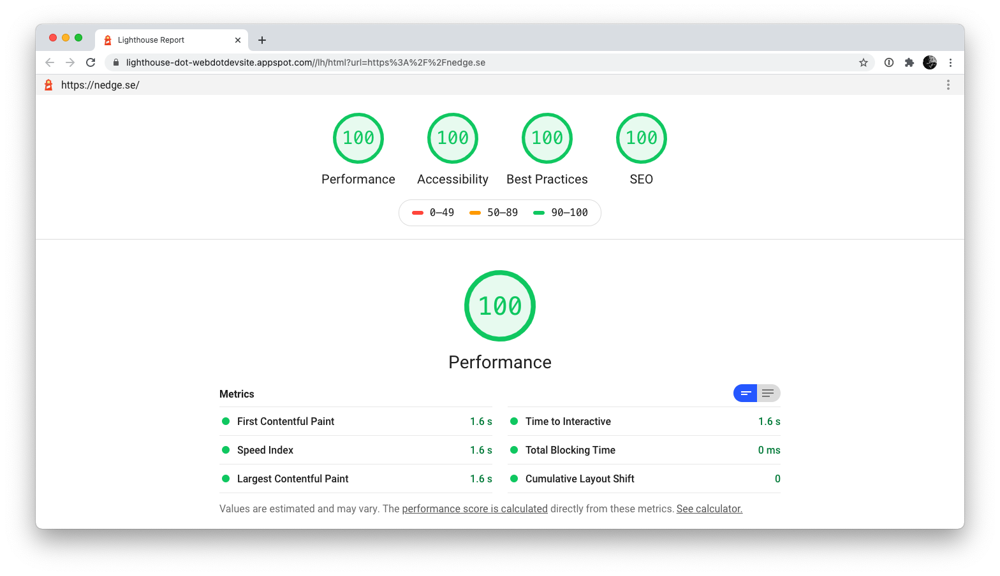

# Nedges hemsida har inget extra fluff

**Välkommen till GitHub!** Här ligger källkoden till Nedges hemsida
([och många andras för den delen](https://github.com/customer-stories?type=enterprise))
och jag vill gärna berätta lite
om varför jag valde att bygga en statisk hemsida och distribuera den med hjälp av
GitHub Pages.

## Design

[Jag älskar WordPress](https://nilslockean.com/) och använder det mer än gärna om ett projekt
drar verklig nytta av det. Dock upplever jag nu för tiden att många webbyråer väljer att
bygga alla sina kunders hemsidor i WordPresss med motivationen att kunden själv kommer
uppdatera innehåll såsom texter och öppettider - bara för att till slut själv göra jobbet
när kunden (med all rätt) inte har tid att lära sig hur WordPress fungerar.

Då sitter webbutvecklaren där och stör sig på att
[WordPress är tungt](https://codex.wordpress.org/Site_Architecture_1.5), och återigen
önskar att hen hade
större kontroll över hemsidans källkod som nu har blivit fullproppad av alla moduler,
tillägg och teman som laddas in via WordPress.

### Tillbaka till dåtiden

Innan innehållshanteringssystem såsom WordPress blev standard byggdes de flesta hemsidor från scratch av en
webbdesigner som visste hur ett tomt dokument på ett par dagar kunde förvandlas till en
färdig hemsida. Numera verkar världen premiera den magiska tjänsten som låter dig
"bygga en professionell hemsida utan att
[skriva](https://sv.wix.com/)
[en](https://www.squarespace.com/)
[enda](https://www.weebly.com/?lang=sv)
[rad](https://www.loopia.se/sitebuilder/)
kod". I verkligheten blir det dessvärre dock så att du får en hemsida som baseras på
ett färdigt tema som bara nästan passar in i din grafiska profil, och du måste ändå anlita
en webbdesigner för att rätta till de sakerna som temat gjorde fel.

**Nytt är inte alltid bättre.** Därför väljer jag att hylla dåtidens arbetssätt och
fortsätter att grotta ned mig i HTML-strukturer för att ge dig en hemsida där jag har
**full kontroll över varenda kodrad**. Du får en helt unik sajt och jag får 100% fria
tyglar att leverera en design som är optimal för dig och dina besökare.

## Integritet

**En statisk hemsida kräver inga cookies.** Det finns ingen möjlighet att "logga in"
någonstans på hemsidan och ingenstans hittar du något
[formulär](https://www.imagescape.com/blog/2008/02/05/are-web-forms-really-secure/).
Säkerhetsuppdateringar är ett minne blott och jag slipper en stor mängd huvudbry.
Dessutom har jag valt att skippa all form av spårning vilket gör att jag inte heller
behöver visa någon störande
[cookie-banner](https://github.blog/2020-12-17-no-cookie-for-you/).

## Tillgänglighet

När jag tar full kontroll över hemsidans källkod kan jag även försäkra mig om att hemsidan
är [tillgänglig för alla användare, inklusive personer med funktionsnedsättning](https://www.funka.com/design-for-alla/lagar-och-regler/webbtillganglighetsdirektivet).
Visst går det att uppnå samma standard på en WordPress-hemsida, men när jag inte behöver
sätta mig in i kod från tredje part blir det väldigt mycket smidigare.

### Redogörelse för https://nedge.se

- All text och alla funktioner går att både se tydligt och komma åt. Det fungerar även utan att användaren behöver scrolla i sidled för att läsa texten.
- Det går att använda tangentbordet för att ta sig fram till samtliga länkar och objekt på sidan. Användarna kommer åt all information enbart med hjälp av tangentbordet.
- Webbplatsens rubriker är uppmärkta med rätt h-element.
- Hela gränssnittet, inklusive tjänster går att använda i smartphones och på surfplattor.
- Hemsidan använder inga formulär.
- Navigeringen och strukturen är likadan på hela webbplatsen och utformningen följer en grafisk profil.
- Alla viktiga delar som avviker från övrigt innehåll är tydligt markerade. De har antingen tydliga kontraster, är understrukna, har en ikon eller något annat som kompletterar färg för att visa att de är klickbara. Kontrasten mellan textfärg och bakgrundsfärg på nedge.se är minst 7:1 (tillgänglighetsgrad AAA).
- Alla klickbara objekt är väl tilltagna.
- Alla länkar är unika och använder rubriken på den sida de länkas till.
- Våra texter har alltid ett tydligt syfte och lyfter det relevanta för läsaren.
- Vi har tydlig kontaktinformation som ligger åtkomliga från alla sidor.
- Alla våra texter är skrivna på begriplig svenska.
- Vi gör alltid en avvägning för att avgöra om vi behöver komplettera texterna på något sätt.
- Rubrikerna innehåller nyckelord och är så tydliga att användarna snabbt förstår vad webbplatsens olika sidor och detaljer handlar om.
- Fokus visas visuellt tydligt när användaren förflyttar sig med tangentbordet på webbplatsens sidor.

## Hastighet

En stor fördel med statiska hemsidor är att de är just statiska. Detta innebär att inget
behöver göras på servern innan hemsidan levereras till användaren. Med andra ord går det
oerhört fort! I senaste mätningen laddade nedge.se på 1.6 sekunder vilket uppskattas av
besökare såväl som sökmotorerna.

## Hållbarhet

Jag vill att din hemsida ska hålla. Alla som har loggat in på en WordPress-sajt som inte
har uppdaterats på ett år kan nog relatera till känslan när magen knyter sig i takt med
att kontrollpanelen visar varning efter varning angående säkerhetshål i utdaterade tillägg
och gamla versioner av WordPress-kärnan.

En statisk hemsida utan kod från tredje part behöver inga säkerhetsuppdateringar.
Den håller sig i precis samma skick som när den gjordes och kommer aldrig se annorlunda
ut från en dag till en annan bara för att en automatisk uppdatering hamnade i konflikt med
en annan.

## Gratis webbhotell

Pricken över i. GitHub låter mig ta del av deras blixtsnabba
[CDN](https://it-ord.idg.se/ord/cdn/) vilket gör att jag inte behöver betala för ett
webbhotell. Jag skriver en rad kod, checkar in den i versionshanteringen (hej, gratis
backup!) och pang så är ändringen publik.

### Ungefärlig årskostnad

Om vi jämför driftkostnaderna mellan en WordPress-hemsida levererad med Loopias privatpaket
(ca 1 100 kr exkl. moms /år) där licenskostnader för teman och tillägg brukar landa på ca. 500
kr per år, sparar vi 1 600 kr som varje år kan gå till mycket roligare saker än serverdrift.

| Tjänst             |  WP + Loopia | GitHub Pages |
| ------------------ | -----------: | -----------: |
| Domännamn          |       120 kr |       120 kr |
| Webbhotell         |     1 100 kr |         0 kr |
| Uppdateringar      |       500 kr |         0 kr |
| **Totalt SEK /år** | **1 720 kr** |   **120 kr** |

## Vill du också ha en statisk hemsida?

Klart du vill. **Skicka ett mail till [nils@lockean.se](mailto:nils@lockean.se)**.

Allt gott,  
--  
Nils Lockean
